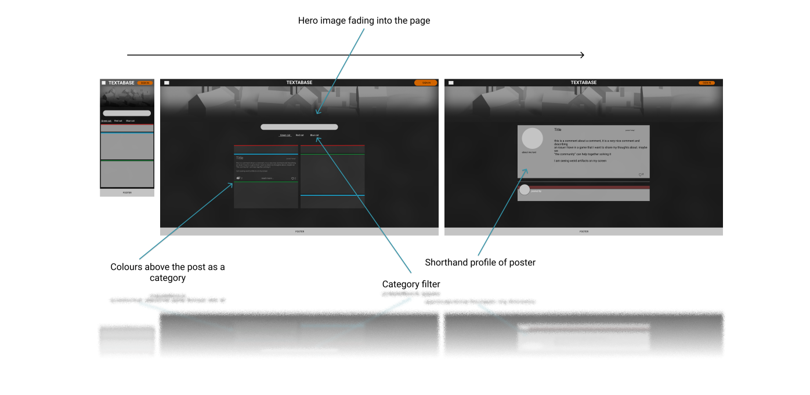

Casper Hille

Full-Stack Development course (5p) | Portfolio project 4 (Django focused project)
---

# Purpose of the Project

The project aims to make a forum/thread based web page with possibility to comment upvote, downvote posts. 

The idea of this page is that it created for a gaming community where users can socialize and have fun.

This page has been made within one week, It is very minimalistic and can has a lot of improvements, But importantly I tried to have different ways of using Django functionality so on View, You will see I tried using different methods of calling the views.

# User Stories

As a user I want to make a comment on a post.

As a user I want to upvote a comment I like.

As a User I want to edit my post to correct written errors.

As a User I want to check certain types of posts

As a User I want to make a post to share my thoughts.

As an Admin I want to remove a post that broke the board rules.

As an Admin I want to edit a post to fix a post.

# Features

## Full crud 

  Create, read, update and delete, are all present.

## repeatable templates

    Thanks to djangos template ystem, the page is easy to add more content on.

## pagination

  this page has pagination, to prevent the page from becomeing long and tiring.

# Future features

## Summer-note
    Summer note can enhance the comments and posts, since this page does not allow for formating.

##  filters

    An ability to be able to filter out catergories and where I've left a comment can be handy.

# Design and planning

## wireframes

like make fast and loose wireframes using a mobile first approach to speed up planning, Whilst leaving room for improvments and also room for disscusion with the "Customer", Like an Agile approach being able to itterate using the wireframe as a base and then work towards the goal. alltho this may lead to Feature creep so you need to be strict.

I've chosen to work with a darker colour scheme, So that catergory colours can pop. And the target group are game enthusiasts, And this will hopefully be on their second screen so a darker colour means less distraction from the game in intense momemnts.

## Diagrams

# Technology

## python

Python is an easy and basic programming language, but it is powerful with libraries to bring out capabilities to use in multiple

## Django Framework

Django is a framework that is made to speed up the proccess of building web applications, Here you can make apps and then use the apps for different projects. it has en extensive documentation.

It is like a all on in framework or "Batteries included philosophy framework"

# testing

## code validation
  During coding i've followed the pep8 guide. naming conventions has been slightly inconsistant
  Due to django tags, I am going to opt out of testing/validating html
  Jigsaw validated style.css with out any remarks

##  automated testing

  I am going to make python automated testing.

## Manual testing

  I have used visual studio, on my computer I don't have NPM installed, so All javascript are going to be manually tested.

  Manually testing if post are acting like intented, 
  This would include, using letters, symbols, numbers.
  So far everything has been working as intended

  testing on responsiveness using the google chrome developer tools to test out.
  responsiveness is good, It struggles on landscape mode on a "Galaxy fold" due to its narrows screen, And 4k looks very tiny(I do not have an oppertunity to try it in a real life scenario)
  
  the page is very minimalist and relies a lot on the bootstrap functionality

## fixed bugs and issues found.

  - I had started of the projects with capitalization at some point and gave me error, I fixed this by going through logs and concluded where the Capitlization happend.
  - I have made an initial commit of starting Django where it posted the insecure SECRET_KEY, It was going to be changed and put into a secret file hidden with ".gitignore", therefor I didn't take the time to hide it.

# Deployment

## via Gitpod

- To use Gitpod, you have to start a repository on Github.
  from there, if you have the Gitpod plugin on your browser, a green button stating "Gitpod" is available. that button redirects you to the GitPod IDE

- When it's done loading, you will see down in the bottom a few tabs. When you press on the terminal, you will be able to input a command

- to deploy your application through an http server, you can write "Python3 -m http.server". This will open the HTTP service, and GitPod will give you a notification "A service is available on port 8000" with three buttons ( make public, open preview, open browser) so when you open your browser, it will open the index.html files if that doesn't exist it will open the readme.md file instead.

- to run a python code, you type python3 FILENAME.py in the terminal.

- This is an excellent place to test your applications before pushing them to Github.

## via Heroku

- Before you deploy, ensure your requirements.txt is updated and accounted for and get your API keys ready.

- to deploy an application through Heroku, you need to make an account. Once you have created an account, you can have up to 5 projects on the free plan.

- To create a new app. Log in, and you'll see a "Create app" button.
  Once pressed, you'll be able to name your project and choose which region your application will host. The name needs to be unique.

- You'll need to set up all your setting before you can deploy your project. You can find the “setting” in the tabs in the dashboard.

  If you have API keys, you can insert them in the Config Vars section, and there is a button to reveal the keys.
  once clicked, the const you used in the poject should be in "KEY" and creds.json in the "VALUE"

  Next, we'll set up build packs. Press the build pack and add the buildpacks you need. If you need more than one, make sure you put them in the correct order, You can drag and drop their list items.

- now, we can start the deployment by heading over to the deploy tab. in this project, I chose to deploy through GitHub.

  After I clicked through GitHub, I had to connect Heroku to my GitHub account. Thereafter I had to search for my project. Once selected.
  I could choose which branch.

  Now I can select an automatic deployment, which updates the app once GitHub updates or manual deployment that will only update Heroku when I press that button again.

  Now we'll wait for Heroku to download all plugins and install all the requirements. Once done, there will be a message telling it completed or failed. Once successful, it will show a button to view your deployed application.

- Now you have your deployed page. Now you can test if everything works as it should or send the links to your friends to show off those accomplishments you have made.

# My personal achievements and what I feel I need to work on.

I need to work on optimizing time, and make use of my mentor. during this project i've had zero contact with my mentor and changed to a new one.
And I need to stop being critical over my pages. I disslike my prevouis projects and started from scratch.

## About Commit messages

Since there a lot of git message conventions and discussions.
I am going to boil them down to something everyone agrees on to follow.

- Imperative, (Add instead of Added)
- Less then 50 characters
- A capital to start and no dot to save on space
- Type: this can be used to quickly see what it does

  - Build: Changes related to structure
  - Chore: Maintence on code users won't see (.gitpod.yml, .gitignore)
  - Feat: New features
  - Fix: fixes for bugs
  - Docs: Changes to Documentation
  - Refactor: Changes that does not add feature or fixes bugs
  - Perf: Changes that aims for increasing performance
  - Style: Changes that affect styling
  - Test: Adding or changing to testcases

- Longer and more descriptive changes can me added as a body (-m "small" -m "body)

here is an example from Convenional Commits:

    <type>[optional scope]: <description>

    [optional body]

    [optional footer(s)]
